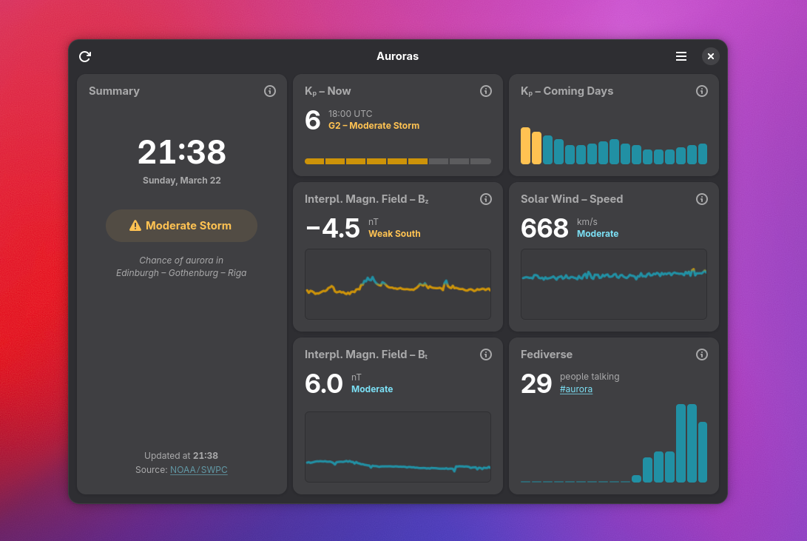

# [Auroras](https://planetpeanut.studio/Auroras)

*Space weather forecast*




<!--## Install on Linux

Auroras is designed and built for the *GNOME* platform. Available on [Flathub](https://flathub.org/en/apps/studio.planetpeanut.Auroras).

```shell
flatpak install flathub studio.planetpeanut.Auroras
```-->


## Build from source

```shell
# Build with Meson
meson setup build
ninja -C build
sudo ninja install -C build
```


## Links

* [@hbons@mastodon.social](https://mastodon.social/@hbons)
* [planetpeanut.studio](https://planetpeanut.studio)

<br>
Have fun, and clear skies!
<br>
<br>
<br>

> [!IMPORTANT]
> Hello! Hylke here. I was <a href="https://www.theguardian.com/technology/2025/may/13/microsoft-layoffs" target="_blank">laid off</a> in 2026. I'd love to work full-time creating **apps for Linux** and contributing **design for FOSS projects**. I hope to gather enough [monthly sponsors](https://github.com/sponsors/hbons) for a minimum wage. Every little helps. Thank you.
